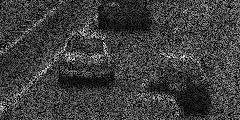
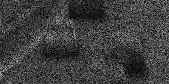
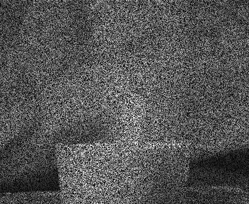
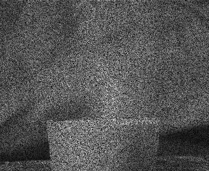
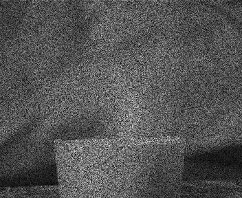

# Single Exposure Coded Snapshot

Implemented Video compressive sensing architecture from the paper on [single shot video](https://www.cs.columbia.edu/CAVE/projects/single_shot_video/) published in ICCV 2011  
Title: "Video from a Single Coded Exposure Photograph using a Learned Over-Complete Dictionary"  
Link to paper: https://www.cs.columbia.edu/CAVE/publications/pdfs/Hitomi_ICCV2011.pdf

## Coded Snapshot

The aim is to get **higher temporal gains** in video acquisition without a significant loss in spatial resolution.  
The Single Exposure image is a coded superposition (summation) of T sub-frames within a unit integration time of the video camera.  
It overcomes space-time tradeoff using pre-pixel coded exposure pattern.  
For better reconstruction, there are restrictions on the coded exposure pattern. However, here we have assumed a symmetric bernoulli distribution is used for the pattern (**C**).  
We pose the above relation in form of a sparse coding problem, with **C** forms the sensing matrix and the frames are sparse in 2D DCT **Phi**.  
**I** = **C** * **Phi** * **Theta**, where **I** is the coded snapshot and **Theta** are the sparse coefficients.  
We use Orthogonal Matching Pursuit (OMP) to solve for **Theta** given **I** and known **C** and **Phi**.

## Code

Code for OMP is present in form of a function in `omp.m`  
Code for Experiments is present in form of a function in `main.m`

Execute `main.m` in MATLAB to reproduce the results. You can adjust the parameters like video file and number of frames (T) in `main.m`.  
The code is tested on MATLAB 2020b, but should work on other versions of MATLAB with no or little changes.

## Results

We used two test videos - `cars.avi` and `flame.avi` present in `data/`.  
The coded snapshot was corrupted with Additive Gaussian Noise with standard deviation 2.  
We evaluated the reconstructed results by computing RMSE (Relative Mean Square Error) w.r.t. original video.

|    Video    |   T = 3  |   T = 5  |   T = 7  |
| ----------- | -------- | -------- | -------- |
|  `cars.avi` | 0.011258 | 0.019089 | 0.031666 |
| `flame.avi` | 0.000670 | 0.001110 | 0.002925 |

Experiment Setup | Coded Snapshot | Reconstructed (left) Original (right)
--- | --- | ---
`cars.avi` with T = 3 |  |  Original (right)")
`cars.avi` with T = 5 |  |  Original (right)")
`cars.avi` with T = 7 |  |  Original (right)")
`flame.avi` with T = 3 |  |  Original (right)")
`flame.avi` with T = 5 |  |  Original (right)")
`flame.avi` with T = 7 |  |  Original (right)")

## Conclusions

We achieve 3x, 5x and 7x gain in temporal resolution, with significantly less loss than a traditional system by using inter-frame redundancies to our advantage.

---

*(This project was a part of [Assignment 1](https://github.com/devansh-dvj/CS754-Assignment-1) for [CS 754: Advanced Image Processing, Spring 2021](https://www.cse.iitb.ac.in/~ajitvr/CS754_Spring2021/), [IIT Bombay](https://www.iitb.ac.in/).)*
